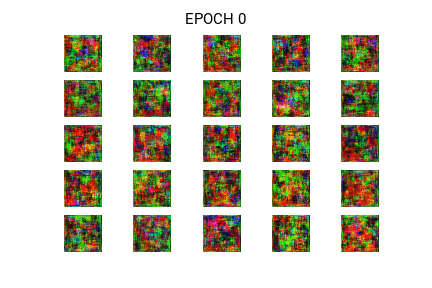

# FaceGAN-Generating-Random-Faces
Generate Random Faces which do not exists. I trained a Deep Convolution GAN (DCGAN) on 100k celebrities photos.

[Fork the notebook in Colab](https://colab.research.google.com/drive/1uj5U_2Fgr5579oT_2wZCrmsfNGAk8yd_)

Training Progress           | Web App view            
:-------------------------:|:-------------------------:
  |   


## Getting Started
Here I will explain how to train the FaceGAN, also how to setup the app running in your own environment. Also I will try to explain basics of Deep Convolutional Generative Adversarial Network.

### Prerequisites
You will need Python 3.X.X with some packages which you can install direclty using requirements.txt.
> pip install -r requirements.txt

### Get the Dataset
I have used 100k celebrities dataset. You can download that dataset from this location [Link](https://www.kaggle.com/greg115/celebrities-100k).

### Train the model (Get new weights for generator or train further)
Run the train_gan.py file. Using the following flags:
* -w, --weights - saved weights directory
* -p, --photo_dir - directory containing face images
* -b, --batch_size - batch size
* -e, --epochs - number of epocs to run
* -i, --inp_dim - dimension of noise for generator
> python3 train_gan.py --weights ./saved_weights -p ./photos -b 32 -e 10000 -i 100 

### Running the app
Use the following command in the app directory to run the app.
> ``` python3 app.py ```

## Authors
* Aditya Jain : [Portfolio](https://adityajain.me)

## Licence
This project is licensed under the MIT License - see the [LICENSE.md](https://github.com/adityajn105/FaceGAN-Generating-Random-Faces/blob/master/LICENSE) file for details

## Must Read
1. [Keep Calm and train a GAN. Pitfalls and Tips on training Generative Adversarial Networks](https://medium.com/@utk.is.here/keep-calm-and-train-a-gan-pitfalls-and-tips-on-training-generative-adversarial-networks-edd529764aa9)